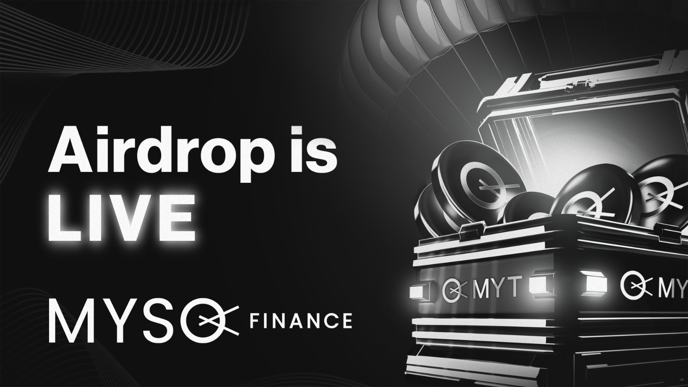
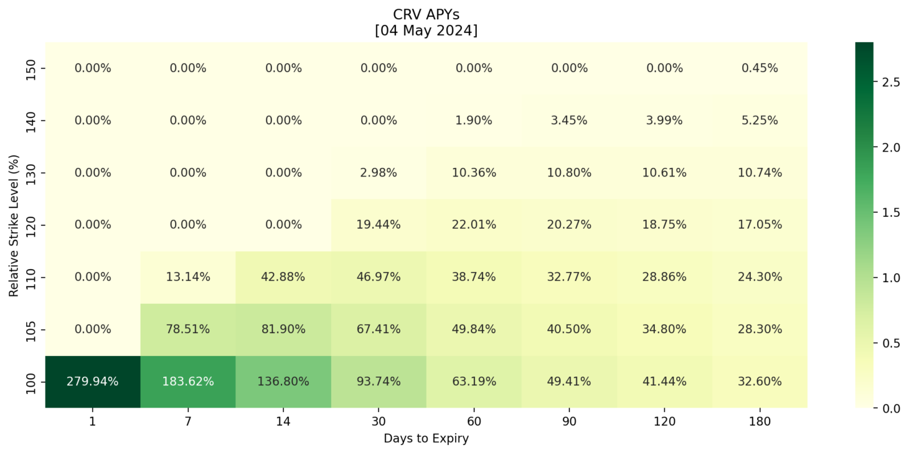
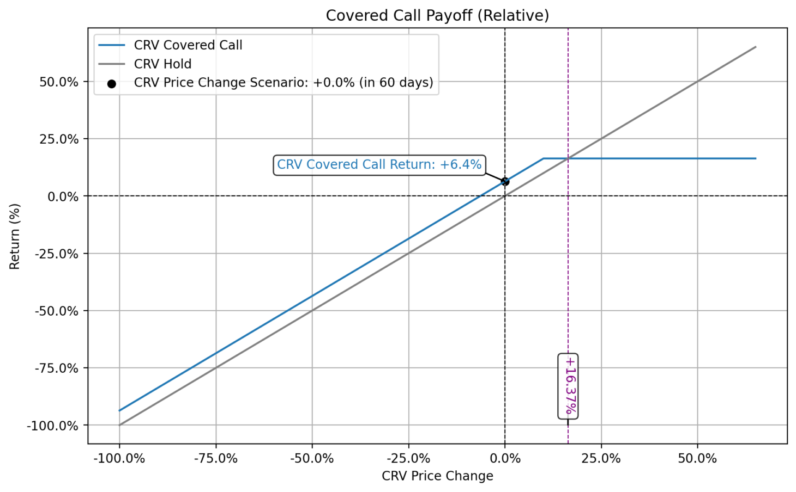
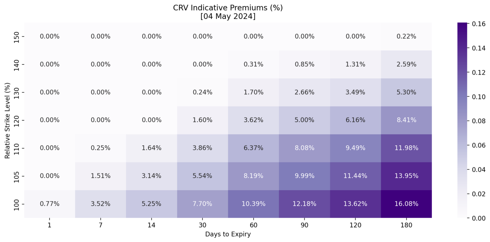
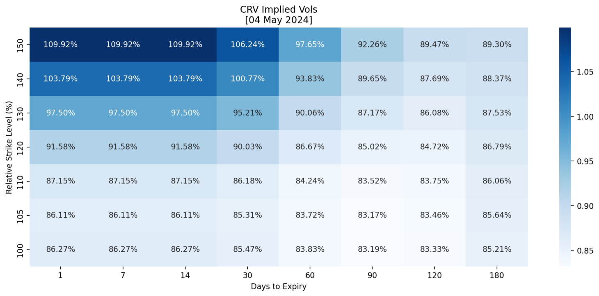

# Curve & MYSO Airdrop #2

**MYSO** is launching the MYSO Token (\$MYT) and distributing tokens to value-aligned communities, including the **Curve DAO**. 

> To check your eligibility and claim \$MYT, go to: https://app.myso.finance/airdrop

## Why MYSO
[MYSO's mission](https://www.myso.finance/) is to be the go-to place for advanced yield enhancement strategies, with a particular focus on bespoke **[covered calls](https://cointelegraph.com/explained/covered-call-options-strategy)** and **structured products**. The MYSO v2 protocol has facilitated over \$1.2M in covered calls, including with the [Telos treasury](https://medium.com/mysofinance/first-native-tlos-covered-call-successfully-completed-cbd69f5e6f3d) as well as the [Evmos treasury](https://medium.com/mysofinance/myso-evmos-treasury-debut-covered-call-strategy-512f6f9b2226) (see [past transactions](#other-users-of-myso)).

MYSO Finance originated out of the [ETHOnline Hackathon in 2021](https://ethglobal.medium.com/ethonline-2021-8bd473b78b99), where it was awarded as one of the finalists. MYSO closed a [\$2.4M seed round](https://medium.com/mysofinance/myso-closes-2-4m-seed-round-2f4f8114144e) in 2022 with several crypto-native investors such as HashKey, Wintermute, Nexo, and GSR.

## MYSO Token
The MYSO Token (\$MYT) allows users to participate in the growth of the MYSO ecosystem. Post airdrop, \$MYT will be distributed exclusively through the MYSO [IOO](https://twitter.com/MysoFinance/status/1785023287459713145), a novel token launch mechanism pioneered by MYSO. \$MYT supply is fixed with fully diluted supply of 100,000,000 tokens and with the following distribution:
* **Ecosystem Growth**: 39.90% or ~39,900,000 \$MYT
* **Treasury**: 30.00 % or ~30,000,000 \$MYT
* **Core Contributors**: 19.17% or ~19,170,000 \$MYT
* **Investors**: 10.93% or ~10,930,000 \$MYT

## Extra MYT Rewards for Curve
Curve token holders can earn extra \$MYT by doing a covered call through MYSO. How to:
* **Step 1**: Create your own non-custodial lender vault on [MYSO](https://app.myso.finance/vaults).
* **Step 2**: Deposit at least \$50,000 worth of CRV into your vault.
* **Step 3**: Get an indicative quote [here](https://myso-covered-call.streamlit.app). Simply select `Curve DAO (CRV)` as token and decide which tenor, and strike combination you'd like to trade.
* **Step 4**: Join [MYSO Discord](https://t.co/hS2cTTd4LE) or [MYSO Telegram](https://t.me/MysoFinance), and share the indicative quote you'd like to trade.
* **Step 5**: Get matched with an institutional trading firm and receive 24% APY in \$MYT.

Note: the \$MYT yield is **on top** of the organic upfront stablecoin premium you earn from the CRV covered call.

## Other Users of MYSO
MYSO v2 has been used by numerous token holders and treasuries, for example:
* **Enzyme holder** earning ~\$12k USDC (97% APY) for lending [\$150k of \$MLN](https://etherscan.io/tx/0x1a13d7458ccb1611c0f7f75ffe49372b71b797d22a5ad8717bff8f036b04338e) for 30 days with a 110% strike
* **UMA holder** earning ~\$7.4k USDC (45% APY) for lending [\$100k of \$UMA](https://etherscan.io/tx/0x2f43a000819fcfb7561e77b0c6a55a45e84f2504ac12ed5c930a1874a28284cc) for 60 days with a 120% strike
* **Golem holder** earning ~\$6k USDC (104% APY) for lending [\$70k of \$GLM](https://etherscan.io/tx/0xf4c3905a1851eaffae4f25a38dc9b435db5bf15bba27120cd235e7e0d2ed0363) for 30 days with a 120% strike
* **Holo holder** earning ~\$4.7k USDC (57% APY) for lending [\$100k of \$HOT](https://etherscan.io/tx/0x003e878355734a7902343a9d6b781e212121e72f84020cd06aa3d688bb62e18c) for 30 days with a 120% strike
* **Telos treasury** lending \$150k of \$wTLOS for 30 days with a 110% strike ([Trx1](https://www.teloscan.io/tx/0xba6e00f66c05680dcab76e603e617501091b96a4b187c35f44469c4e35193fc3), [Trx2](https://www.teloscan.io/tx/0xe70f2e40442d5d276589686c9934a2d72492755db390795bb542ea7a3bc56bf1), [Trx3](https://www.teloscan.io/tx/0x4e07294253097871f3d20ffe7b9d91beca11b4f286f0cab5c3edd23912a7122c)), and another [\$100k of \$wTLOS](https://www.teloscan.io/tx/0x2db20b52cd3d5250b67a85c8700091a6411c1513683e313122b72619b3f2465d) for 30 days with a 110% strike.
* **DIA holder** earning ~\$10.5k USDC (63% APY) for lending [\$100k of \$DIA](https://etherscan.io/tx/0x67f53cca963843035041a129626342fbd2581c3233615c8b33e80d3cee880cac) for 60 days with a 110% strike
* **Evmos treasury** lending [\$100k of \$EVMOS](https://escan.live/tx/0x43decacfac2fef8eaae6ae4d3f60ec125776418fc1abf7f2b2611b8737b6b8ef) for 30 days with a 110% strike, and another [\$100k of \$EVMOS](https://escan.live/tx/0x43decacfac2fef8eaae6ae4d3f60ec125776418fc1abf7f2b2611b8737b6b8ef) for 30 days with a 120% strike
* **Beam holder** lending [\$140k of \$BEAM](https://etherscan.io/tx/0x4fa00e8611f60e149f7bf6f65fcadf94889ecfb9ca147a8538f045d78210ebc2) for 30 days with a 140% strike
* **Liquity holder** lending [\$150k of \$LQTY](https://etherscan.io/tx/0x408fd3633f8a678b3c42ab0f57bc964e4ce98c016b323c7d564459df3f262dd4) for 90 days with a 110% strike

To see more transactions, please refer to our [stats page](https://app.myso.finance/stats/loans).

### Audits:
- [Trail of Bits](https://github.com/trailofbits/publications/blob/master/reviews/2023-04-mysoloans-securityreview.pdf)
- [Statemind](https://github.com/statemindio/public-audits/blob/main/Myso%20Finance/2023-08-15_Myso_v2.pdf)
- [Omniscia](https://omniscia.io/reports/myso-finance-lending-protocol-644911cef1412d00142bf698/)

### Other Links:
- [Website](https://www.myso.finance/)
- [dApp](https://app.myso.finance/)
- [Github](https://github.com/mysofinance)
- [Twitter](https://twitter.com/MysoFinance)

# Appendix

## Indicative APYs for CRV Covered Call

## CRV Covered Call Payoff Diagram (Example)

## Indicative Premiums for CRV Covered Call

## Indicative Implied Vols for CRV Covered Call
